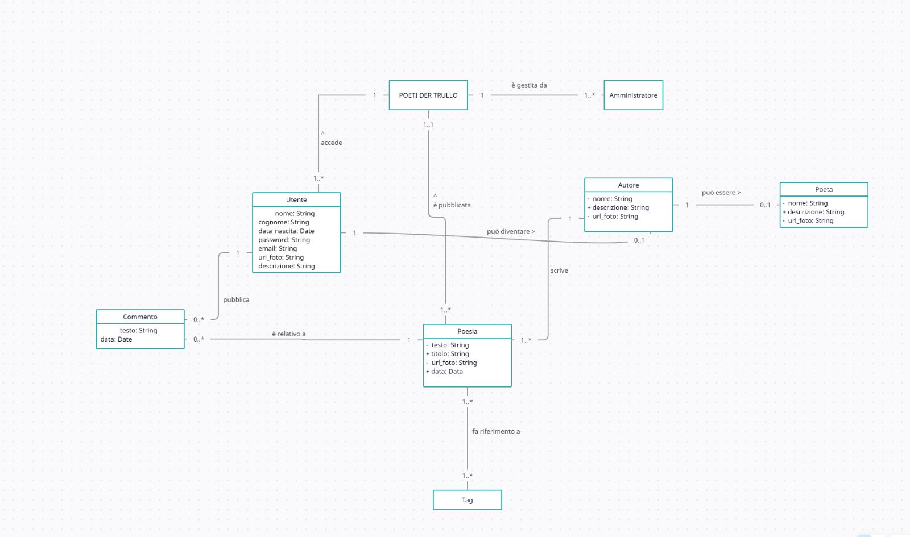

# SIW POESIA 
Progetto Sistemi Informativi su Web

## Technologies
Il progetto è stato realizzato usando:
* Spring Framework 4
    * Java 17
    * Thymeleaf
    * PostgreSQL 15
* Bootstrap 5.2.0

## Modello di dominio

## Partecipanti
Hermann Tamilia, Irene Lontano, Luca Sparapani